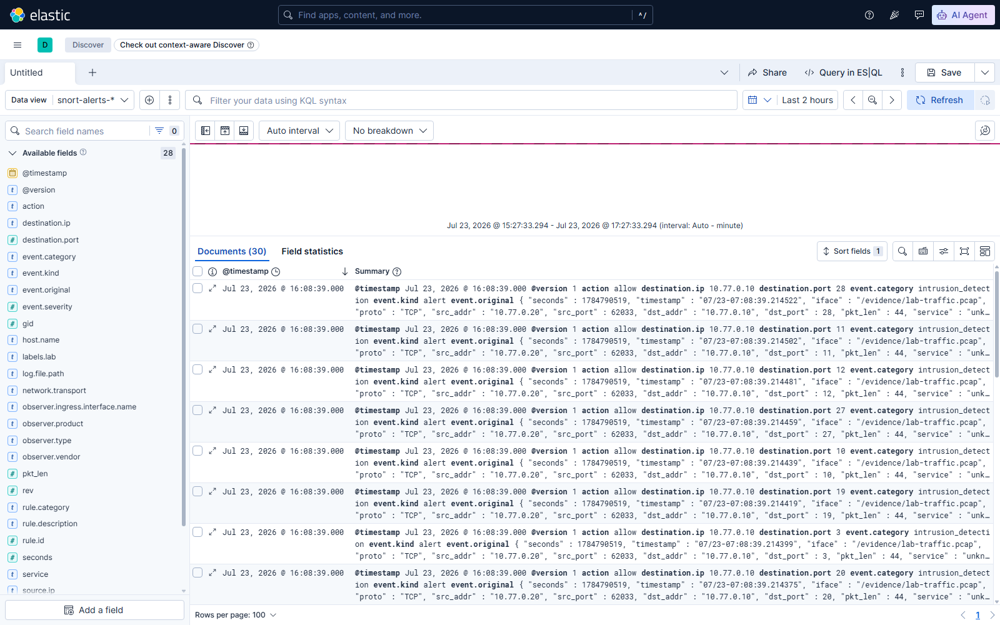
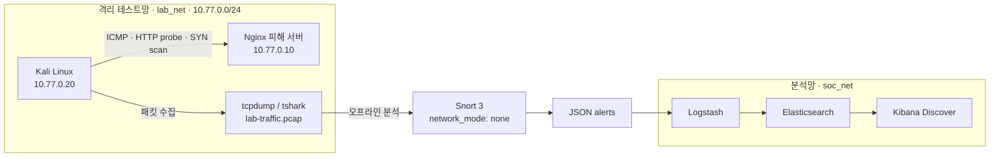

# Network Forensics Lab


[](https://github.com/teriyakki-jin/network-forensics-lab/actions/workflows/validate.yml)

Docker Desktop 위에 격리된 공격·피해 테스트망을 만들고, 패킷 수집부터 IDS 탐지와 시각화까지 한 번에 재현하는 네트워크 포렌식 실습 프로젝트입니다.

> Kali → PCAP → Snort 3 → Logstash → Elasticsearch → Kibana

**Portfolio focus:** Network Security · Digital Forensics · Detection Engineering · Data Pipeline · DevOps Automation

[실행 화면](#실행-화면) · [아키텍처](#아키텍처) · [탐지 결과](#탐지-시나리오와-결과) · [빠른 시작](#빠른-시작) · [기술 사례](docs/CASE_STUDY.md)

## 실행 화면



위 화면은 이 저장소의 테스트 트래픽을 직접 실행한 결과입니다. `snort-alerts-*` 데이터 뷰에서 30개의 IDS 경보와 원본 패킷 필드를 확인할 수 있습니다.

## 핵심 성과

| 재현성 | 탐지 | 무결성 | 가시성 | 품질 자동화 |
|---|---|---|---|---|
| **1개 명령**으로 전체 실행 | 커스텀 규칙 **3개** | PCAP **SHA-256** 검증 | Kibana 문서 **30건** | GitHub Actions **5종 검증** |

- 공격 트래픽 생성부터 Kibana 데이터 뷰 구성까지 자동화했습니다.
- 원본 PCAP 84패킷, Snort JSON 30행, Elasticsearch 30문서를 교차 검증했습니다.
- 보안 경계를 코드로 표현했습니다: 격리망, localhost 바인딩, Snort 무네트워크 실행.
- 실제 장애 원인을 분석하고 체크섬 오프로딩, WSL 저장소, Kibana 초기화 문제를 해결했습니다.

## 아키텍처



`lab_net`은 Docker의 `internal: true` 네트워크입니다. 공격 트래픽은 컨테이너 내부의 고정 IP 사이에서만 생성됩니다. Snort는 네트워크 인터페이스에 직접 붙지 않고, 저장된 PCAP을 `network_mode: none` 상태에서 분석합니다.

## 탐지 시나리오와 결과

| 단계 | 생성 트래픽 | Snort SID | 탐지 결과 |
|---|---|---:|---:|
| 연결 확인 | ICMP Echo Request 3회 | `1000001` | 3건 |
| 의심 경로 접근 | `GET /admin?cmd=id` | `1000002` | 1건 |
| 제한형 포트 스캔 | TCP 1~30번 SYN 스캔 | `1000003` | 26건 |
| **합계** |  |  | **30건** |

수집된 PCAP은 84패킷, 6,778바이트이며 현재 샘플의 SHA-256은 다음과 같습니다.

```text
504c3711f3244644293fc261d7424b3971dbddb2eb8402fcfe2ad1c57877bbdd
```

## 구성 요소

| 구성 요소 | 역할 | 네트워크/포트 |
|---|---|---|
| Kali Linux | 트래픽 생성, `tcpdump`, `tshark`, `nmap` | `10.77.0.20` |
| Nginx | 실습용 피해 서버 | `10.77.0.10:80` |
| Snort 3 | PCAP 오프라인 IDS 분석 | 네트워크 없음 |
| Logstash 9.4.2 | Snort JSON을 ECS 형태로 정규화 | `soc_net` |
| Elasticsearch 9.4.2 | 경보 색인 및 검색 | `127.0.0.1:9200` |
| Kibana 9.4.2 | Discover 기반 분석 UI | `127.0.0.1:5601` |

실습 PC의 부담을 줄이기 위해 JVM/Node 메모리를 Elasticsearch 1GB, Logstash 384MB, Kibana 768MB로 제한했습니다.

## 설계 의사결정

| 결정 | 선택 이유 | 트레이드오프 |
|---|---|---|
| Docker 격리망 | 외부 시스템에 테스트 트래픽이 전달되는 것을 방지 | 실제 라우팅 환경과 차이가 있음 |
| Snort 오프라인 PCAP 분석 | 동일 증거로 규칙을 반복 검증 가능 | 실시간 차단 기능은 없음 |
| ECS 유사 필드 변환 | IP·포트·규칙 기반 KQL 검색 단순화 | 완전한 ECS 호환은 추가 매핑 필요 |
| 샘플 증거 버전 관리 | 실행 없이도 입력·결과·해시 검토 가능 | 대규모 PCAP에는 Git LFS 필요 |
| 경량 CI와 로컬 통합 테스트 분리 | PR 검증 속도와 실제 스택 검증을 모두 확보 | CI에서는 전체 Elastic 실행을 생략 |

## 문제 해결 하이라이트

| 문제 | 원인 | 해결 |
|---|---|---|
| HTTP 규칙 미탐지 | Docker 가상 NIC 체크섬 오프로딩 | Snort 오프라인 분석에 `-k none` 적용 |
| Docker 저장소 읽기 전용 전환 | 이미지 압축 해제 중 호스트 디스크 소진 | 공간 확보, WSL/Docker 복구, 재검증 |
| Kibana UI 준비 지연 | 최초 플러그인 초기화와 saved object migration | `/api/status` 확인과 데이터 뷰 자동 구성 |

자세한 판단 근거와 트러블슈팅 과정은 [Technical Case Study](docs/CASE_STUDY.md)에 정리했습니다.

## 빠른 시작

### 요구 사항

- Windows 10/11 + WSL2
- Docker Desktop과 Docker Compose
- 최초 이미지 다운로드 및 압축 해제를 위한 충분한 디스크 여유 공간
- PowerShell 5.1 이상

### 저장소 받기

```powershell
Set-Location D:\develop
git clone https://github.com/teriyakki-jin/network-forensics-lab.git
Set-Location .\network-forensics-lab
```

### 전체 파이프라인 실행

```powershell
powershell -NoProfile -ExecutionPolicy Bypass -File .\scripts\run-lab.ps1
```

스크립트는 다음 작업을 자동으로 수행합니다.

1. Docker 엔진 확인
2. Kali와 Nginx 격리망 시작
3. `tcpdump` 패킷 캡처
4. ICMP, HTTP probe, 제한형 SYN scan 생성
5. PCAP SHA-256 기록
6. Snort 3 오프라인 분석
7. Elastic Stack 시작 및 문서 적재 확인
8. Kibana 준비 상태 확인 및 `snort-alerts-*` 데이터 뷰 구성

Elastic 이미지 다운로드를 미루고 PCAP과 Snort까지만 실행하려면 다음 옵션을 사용합니다.

```powershell
powershell -NoProfile -ExecutionPolicy Bypass -File .\scripts\run-lab.ps1 -SkipElastic
```

## Kibana에서 분석하기

1. [Kibana Discover](http://127.0.0.1:5601/app/discover)에 접속합니다.
2. `run-lab.ps1`이 생성한 `snort-alerts-*` 데이터 뷰를 선택합니다.
3. 샘플 이벤트가 보이지 않으면 시간 범위를 `Last 2 hours` 이상으로 넓힙니다.

유용한 KQL 예시:

```text
rule.id: 1000002
```

```text
source.ip: "10.77.0.20" and destination.ip: "10.77.0.10"
```

```text
rule.description: "LAB TCP SYN Scan"
```

```text
network.transport: "tcp" and destination.port <= 30
```

Elasticsearch에서 직접 적재 건수를 확인할 수도 있습니다.

```powershell
Invoke-RestMethod http://127.0.0.1:9200/snort-alerts-*/_count
```

## Wireshark / tshark 분석

Wireshark에서 `evidence/lab-traffic.pcap`을 열고 다음 디스플레이 필터를 적용합니다.

```text
icmp && ip.src == 10.77.0.20
```

```text
http.request.uri contains "/admin"
```

```text
tcp.flags.syn == 1 && tcp.flags.ack == 0
```

컨테이너의 `tshark`로도 같은 증거를 확인할 수 있습니다.

```powershell
docker compose exec kali tshark -r /evidence/lab-traffic.pcap -q -z conv,tcp
docker compose exec kali tshark -r /evidence/lab-traffic.pcap -Y 'http.request' -V
docker compose exec kali tshark -r /evidence/lab-traffic.pcap -Y 'tcp.flags.syn == 1 && tcp.flags.ack == 0'
```

## 증거 무결성 확인

```powershell
$actual = (Get-FileHash .\evidence\lab-traffic.pcap -Algorithm SHA256).Hash.ToLowerInvariant()
$expected = (Get-Content .\evidence\lab-traffic.pcap.sha256).Split(' ')[0]
$actual -eq $expected
```

경보를 SID별로 집계하려면:

```powershell
Get-Content .\alerts\alert_json.txt |
    ForEach-Object { $_ | ConvertFrom-Json } |
    Group-Object sid |
    Select-Object Name, Count
```

## 자동 검증

GitHub Actions의 `Validation` 워크플로는 push와 pull request마다 다음을 확인합니다.

- `docker compose config` 구성 유효성
- Snort JSON 파싱 및 샘플 30행
- PCAP SHA-256 무결성
- Bash와 Node.js 구문
- 모든 PowerShell 스크립트 구문

로컬에서 동일한 핵심 검증을 빠르게 실행하려면:

```powershell
docker compose config --quiet
node --check .\scripts\capture-kibana.mjs
```

## 스크린샷 다시 만들기

Kibana가 실행 중이고 데이터 뷰 `snort-alerts`가 존재할 때 다음 명령으로 README 이미지를 갱신할 수 있습니다.

```powershell
node .\scripts\capture-kibana.mjs
```

기본 Chrome 경로가 다르면 `CHROME_PATH` 환경 변수로 지정합니다.

```powershell
$env:CHROME_PATH = 'C:\Program Files\Google\Chrome\Application\chrome.exe'
node .\scripts\capture-kibana.mjs
```

## 디렉터리 구조

```text
network-forensics-lab/
├─ alerts/                  # Snort JSON 경보
├─ assets/                  # README 스크린샷
├─ docs/                    # 기술 사례와 설계 판단
├─ evidence/                # PCAP, 해시, nmap 결과
├─ kali/                    # Kali 분석 이미지
├─ logstash/pipeline/       # JSON → ECS 변환 파이프라인
├─ scripts/                 # 실행, 종료, 화면 캡처 자동화
├─ snort/                   # Snort 로컬 규칙과 실행기
├─ compose.yaml
├─ README.md
└─ VERIFICATION.md
```

## 운영 명령

현재 상태 확인:

```powershell
docker compose ps
docker compose logs --tail 100 logstash kibana
```

컨테이너만 종료하고 Elastic 데이터를 보존:

```powershell
powershell -NoProfile -ExecutionPolicy Bypass -File .\scripts\stop-lab.ps1
```

Elastic 볼륨까지 삭제:

```powershell
powershell -NoProfile -ExecutionPolicy Bypass -File .\scripts\stop-lab.ps1 -DeleteElasticData
```

`-DeleteElasticData`는 기존 Elasticsearch 인덱스와 Logstash 처리 상태를 함께 삭제합니다.

## 문제 해결

### Kibana에 데이터가 보이지 않음

- 시간 범위를 `Last 2 hours` 이상으로 변경합니다.
- `Invoke-RestMethod http://127.0.0.1:9200/snort-alerts-*/_count`로 적재 여부를 확인합니다.
- `docker compose logs logstash`에서 파이프라인 오류를 확인합니다.

### Docker Desktop / WSL 오류

관리자 PowerShell에서 다음 명령을 실행하거나 Windows를 재시작합니다.

```powershell
wsl --shutdown
Restart-Service WslService -Force
Start-Process 'C:\Program Files\Docker\Docker\Docker Desktop.exe'
```

### `read-only file system` 오류

호스트 드라이브의 여유 공간을 확인합니다. Docker 이미지 압축 해제 중 공간이 소진되면 WSL의 Docker 저장소가 읽기 전용으로 전환될 수 있습니다.

```powershell
[System.IO.DriveInfo]::new('C').AvailableFreeSpace / 1GB
```

## 보안 범위와 제한사항

- 이 프로젝트는 **로컬 격리 실습 전용**입니다.
- Elasticsearch/Kibana 인증은 편의를 위해 비활성화되어 있으며 포트는 localhost에만 바인딩됩니다.
- Snort는 인라인 차단 장비가 아니라 저장된 PCAP을 분석하는 오프라인 IDS로 동작합니다.
- 스캔 대상은 실습용 Nginx 컨테이너와 TCP 1~30번 포트로 제한됩니다.
- 허가받지 않은 외부 시스템이나 운영망을 대상으로 사용하지 마십시오.

## 확장 로드맵

- [ ] Brute force, DNS tunneling, web exploit 트래픽 추가
- [ ] Suricata EVE JSON과 Snort 결과 비교
- [ ] Kibana Lens 대시보드 자동 프로비저닝
- [ ] MITRE ATT&CK technique 및 Sigma 규칙 매핑
- [ ] 경량 PCAP 회귀 테스트를 CI에 추가

## 더 읽기

- [실행 검증 결과](VERIFICATION.md)
- [설계·트러블슈팅 Technical Case Study](docs/CASE_STUDY.md)
