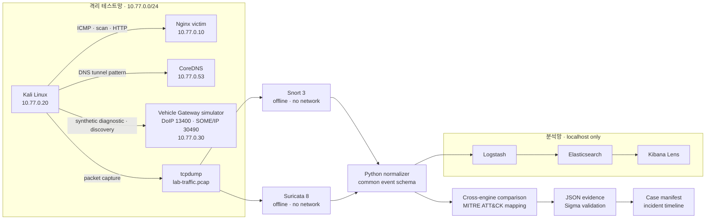

# Automotive Ethernet Network Forensics Lab


[](https://github.com/teriyakki-jin/network-forensics-lab/actions/workflows/validate.yml)

Docker 격리망에서 기업·생산·차량 Ethernet 침해 징후를 합성하고, 동일 PCAP을 Snort 3와 Suricata 8로 교차 분석해 사건 타임라인과 증거 manifest까지 생성하는 재현 가능한 네트워크 포렌식 랩입니다.


## 핵심 결과

| 재현성 | 평가 범위 | Snort 3 | Suricata 8 | 분석·자동화 |
|---|---:|---:|---:|---:|
| 명령 1개 | 공격 8 + 정상 8 · 5회 | recall 100% · FPR 0% | recall 100% · FPR 0% | 40 tests · 92% coverage |

- 동일 공격 PCAP에서 두 IDS가 8개 시나리오를 모두 탐지했고 시나리오별 경보 수 차이는 `0`이었습니다.
- 공격·정상 paired fixture를 5회 반복 분석한 로컬 회귀에서 두 엔진 모두 `TP 40 / TN 40 / FP 0 / FN 0`, 재현성 `5/5`를 기록했습니다.
- 두 paired PCAP은 각각 SHA-256 checksum을 포함하며 CI에서 분석 전에 무결성을 재검증합니다.
- 합성 DoIP 진단 명령과 SOME/IP 서비스 탐색을 실제 프로토콜 바이트로 생성하고 Wireshark에서 해석할 수 있습니다.
- SHA-256, PCAP 구조, 패킷 수를 독립 Python 검증기로 확인합니다.
- 8개 탐지를 MITRE ATT&CK 및 ATT&CK for ICS 기술과 Sigma 규칙에 연결했습니다.
- `case-manifest.json`은 PCAP과 파생 증거 5개의 SHA-256·센서·수집시각·도구 버전을 기록합니다.
- Docker 공격망은 `internal: true`, IDS 분석 컨테이너는 `network_mode: none`입니다.
- 현재 테스트 스위트는 40개, branch coverage 포함 전체 커버리지는 92%입니다.

> 수치는 저장소에 포함된 로컬 회귀 fixture 결과입니다. 실제 운영망의 일반적인 탐지 정확도를 의미하지 않습니다.

## 아키텍처



공격 트래픽은 외부로 라우팅되지 않습니다. Snort와 Suricata는 라이브 인터페이스가 아니라 저장된 PCAP만 읽으므로 동일 증거에 대해 규칙 결과를 반복 비교할 수 있습니다.

## 탐지 시나리오

| 시나리오 | 테스트 트래픽 | ATT&CK | Snort | Suricata |
|---|---|---|---:|---:|
| `icmp_echo` | ICMP echo burst | T1018 Remote System Discovery | 1 | 1 |
| `http_admin_probe` | `/admin?cmd=id` 접근 | T1190 Exploit Public-Facing Application | 1 | 1 |
| `tcp_syn_scan` | 제한된 TCP SYN scan | T1046 Network Service Discovery | 33 | 33 |
| `brute_force` | 반복 HTTP Basic 인증 | T1110 Brute Force | 1 | 1 |
| `dns_tunneling` | 긴 subdomain DNS query | T1071.004 DNS | 4 | 4 |
| `web_exploit` | SQL injection 형태의 query | T1190 Exploit Public-Facing Application | 1 | 1 |
| `doip_unauthorized_diagnostic` | DoIP 진단 메시지와 UDS 쓰기 명령 | T1692.001 Unauthorized Command Message | 1 | 1 |
| `someip_service_discovery` | SOME/IP-SD FindService 메시지 | T0846.003 Multicast Discovery | 1 | 1 |
| **합계** |  |  | **43** | **43** |

각 시나리오는 다음 세 탐지 표현을 함께 가집니다.

- Snort 규칙: [`snort/local.rules`](snort/local.rules)
- Suricata 규칙: [`suricata/local.rules`](suricata/local.rules)
- Sigma 규칙: [`detection/sigma`](detection/sigma)

규칙 SID, 시나리오, ATT&CK tactic/technique의 단일 기준은 [`detection/rule-catalog.json`](detection/rule-catalog.json)입니다.

## Threat → Control → Evidence

| 위협·실패 모드 | 통제 | 검증 가능한 증거 |
|---|---|---|
| 테스트 트래픽의 외부 유출 | Docker internal network, 고정 사설 IP | [`compose.yaml`](compose.yaml) 계약 테스트 |
| IDS별 형식 차이 | 공통 이벤트 스키마로 정규화 | [`alerts/normalized-alerts.jsonl`](alerts/normalized-alerts.jsonl) |
| 단일 IDS 편향 | 동일 PCAP을 두 엔진으로 교차 분석 | [`evidence/ids-comparison.json`](evidence/ids-comparison.json) |
| 공격만으로 인한 오탐 평가 부재 | 동일 8개 시나리오의 공격·정상 paired fixture를 5회 반복 | [`evidence/evaluation/detection-metrics.json`](evidence/evaluation/detection-metrics.json) |
| PCAP 변조 | SHA-256 및 binary header 검사 | [`evidence/pcap-regression.json`](evidence/pcap-regression.json) |
| 파생 증거 출처 불명 | 사건번호·센서·수집시각·도구 버전과 전체 artifact hash 기록 | [`evidence/case-manifest.json`](evidence/case-manifest.json) |
| 경보의 시간적 맥락 유실 | 정규화 경보를 UTC 기준으로 정렬 | [`evidence/incident-timeline.json`](evidence/incident-timeline.json) |
| 탐지 설명의 표준 부재 | ATT&CK 및 Sigma 매핑 | [`evidence/sigma-validation.json`](evidence/sigma-validation.json) |
| 수동 대시보드 구성 드리프트 | 고정 ID Lens dashboard API upsert | [`scripts/setup-kibana.ps1`](scripts/setup-kibana.ps1) |
| 회귀 규칙의 조용한 실패 | PCAP 기반 Snort·Suricata CI | [Validation workflow](.github/workflows/validate.yml) |

## 빠른 시작

### 요구 사항

- Windows 10/11 + WSL2
- Docker Desktop / Docker Compose
- PowerShell 5.1 이상
- Python 3.12 이상

### 전체 랩 실행

```powershell
git clone https://github.com/teriyakki-jin/network-forensics-lab.git
Set-Location .\network-forensics-lab
powershell -NoProfile -ExecutionPolicy Bypass -File .\scripts\run-lab.ps1
```

스크립트는 다음 작업을 순서대로 수행합니다.

1. Kali, victim, DNS, 차량 Gateway가 있는 격리망 시작
2. 8개 허가된 기업·차량 네트워크 테스트 트래픽 생성 및 PCAP 수집
3. PCAP SHA-256 기록
4. Snort 3와 Suricata 8 오프라인 분석
5. 경보 정규화, 엔진별 탐지 비교, Sigma 검증
6. 사건 manifest와 시간순 타임라인 생성
7. Elasticsearch 적재 문서 수 확인
8. Kibana 데이터 뷰와 Lens 대시보드 생성

Elastic Stack 없이 PCAP과 두 IDS만 검증하려면 다음 옵션을 사용합니다.

```powershell
.\scripts\run-lab.ps1 -SkipElastic
```

공격·정상 paired fixture를 생성하고 두 IDS를 5회 반복 평가하려면 다음 명령을 사용합니다.

```powershell
.\scripts\run-evaluation.ps1
```

커밋된 fixture만 다시 분석하려면 `-UseCommittedFixtures`를 추가합니다.

### 분석 화면

- [Kibana Lens dashboard](http://127.0.0.1:5601/app/dashboards#/view/network-forensics-overview)
- [Kibana Discover](http://127.0.0.1:5601/app/discover)
- Elasticsearch count: `http://127.0.0.1:9200/ids-alerts-*/_count`

종료 및 리소스 정리:

```powershell
docker compose down -v --remove-orphans
```

## 독립 검증

개발 의존성을 설치한 후 Docker 없이도 커밋된 fixture와 탐지 콘텐츠를 검증할 수 있습니다.

```powershell
python -m pip install -r .\requirements-dev.txt
python -m unittest discover -s tests -v
python -m forensics.cli verify-fixture `
  --pcap evidence/lab-traffic.pcap `
  --checksum evidence/lab-traffic.pcap.sha256
python -m forensics.cli validate-sigma --directory detection/sigma
.\scripts\run-comparison.ps1
```

현재 fixture 무결성 값:

```text
78cb430a5760aeb276e27b149b2e18017c68aab414155bc2abe31778f64e6530
```

## Wireshark / tshark 분석

Wireshark에서 [`evidence/lab-traffic.pcap`](evidence/lab-traffic.pcap)을 열고 다음 display filter를 적용할 수 있습니다.

```text
icmp && ip.src == 10.77.0.20
```

```text
tcp.flags.syn == 1 && tcp.flags.ack == 0
```

```text
dns.qry.name.len > 50
```

```text
http.request.uri contains "/admin" || http.request.uri contains "UNION"
```

```text
doip || tcp.port == 13400
```

```text
someip || udp.port == 30490
```

CLI 예시:

```powershell
docker compose exec kali tshark -r /evidence/lab-traffic.pcap -q -z conv,tcp
docker compose exec kali tshark -r /evidence/lab-traffic.pcap -Y 'dns.qry.name.len > 50'
docker compose exec kali tshark -r /evidence/lab-traffic.pcap -Y doip
docker compose exec kali tshark -r /evidence/lab-traffic.pcap -d udp.port==30490,someip -Y someip
```

## 객관적 측정 원칙

- 경보 개수는 탐지 정확도로 표현하지 않습니다.
- 고유 시나리오는 공격 8개와 정상 8개이며, 반복 횟수는 5회입니다. 엔진별 80 observations를 80개의 고유 시나리오로 표현하지 않습니다.
- 로컬 paired synthetic fixture에서 Snort와 Suricata 모두 recall `100%`, precision `100%`, FPR `0%`, 반복 성공 `5/5`를 기록했습니다.
- 결과의 confusion matrix는 두 IDS 각각 `TP 40 / TN 40 / FP 0 / FN 0`입니다.
- 이는 저장소의 제한된 합성 fixture에 대한 회귀 결과이며 운영 환경의 탐지 정확도로 일반화하지 않습니다.

## CI 품질 게이트

GitHub Actions는 push와 pull request마다 다음을 검증합니다.

- Python 단위·CLI·저장소 계약 테스트와 branch coverage
- PCAP SHA-256 및 구조 회귀 검사
- 8개 Sigma 규칙의 필수 필드와 ATT&CK tag
- 커밋된 PCAP에 대한 Snort·Suricata 오프라인 재분석
- 커밋된 공격·정상 paired fixture 5회 분석과 recall·precision·FPR 회귀 검사
- 두 엔진이 모든 시나리오를 탐지했는지 비교
- Compose, Bash, Node.js, PowerShell 구문 검사
- Actions SHA 고정 및 컨테이너 이미지 버전 정책

## 주요 설계 결정

| 결정 | 이유 | 한계 |
|---|---|---|
| 한 PCAP을 두 IDS가 공유 | 입력 차이를 제거해 규칙 차이만 비교 | 실시간 인라인 차단은 평가하지 않음 |
| 최소 공통 이벤트 스키마 | 엔진 종속 필드를 검색·시각화 가능한 구조로 통합 | 전체 ECS 구현은 아님 |
| 룰 카탈로그를 단일 기준으로 사용 | SID와 ATT&CK 매핑 드리프트 방지 | 룰 변경 시 catalog도 함께 갱신 필요 |
| Lens API 기반 dashboard as code | 수동 UI 작업 없이 같은 화면 재현 | Kibana API 버전에 영향받음 |
| 작은 결정적 fixture를 Git에 포함 | PR에서 빠른 회귀 검증 | 대규모 실제망 성능을 대표하지 않음 |
| 공격·정상 시나리오를 같은 ID로 pairing | 규칙별 탐지와 비탐지를 같은 기준으로 평가 | 합성 정상 트래픽이 운영망 다양성을 대표하지 않음 |

## 디렉터리 구조

```text
network-forensics-lab/
├─ .github/workflows/validate.yml
├─ alerts/                    # 두 IDS 원본/정규화 경보
├─ assets/                    # 포트폴리오 스크린샷
├─ detection/                 # 룰 catalog와 Sigma
├─ dns/                       # 격리망 CoreDNS
├─ evidence/                  # PCAP, hash, 비교·검증 결과
├─ evaluation/                # paired fixture ground truth
├─ forensics/                 # 정규화·비교·무결성·사건 증거 Python package
├─ kali/                      # traffic generator image/script
├─ logstash/                  # IDS 공통 이벤트 ingestion
├─ scripts/                   # one-click 실행·dashboard·캡처
├─ snort/                     # Snort 3 rules/runner
├─ suricata/                  # Suricata 8 rules/runner
├─ tests/                     # unit, CLI, repository contracts
├─ vehicle-gateway/           # 격리 DoIP·SOME/IP 응답 시뮬레이터
└─ victim/                    # Nginx test target
```

## 범위와 제한사항

- 이 프로젝트는 소유한 로컬 시스템에서 실행하는 교육·회귀 검증용 랩입니다.
- 스캔 범위와 목적지는 격리 컨테이너의 고정 IP로 제한합니다.
- Elasticsearch와 Kibana 인증은 로컬 편의를 위해 비활성화되어 있으며 포트는 `127.0.0.1`에만 바인딩됩니다.
- 탐지 결과는 저장소 fixture에 대한 결과이며 운영망의 FPR, recall, 처리량을 일반화하지 않습니다.
- DoIP·SOME/IP 트래픽은 공개 프로토콜 구조를 본뜬 합성 fixture이며 실제 차량 ECU나 양산 시스템 검증 결과가 아닙니다.
- 대규모 PCAP, 암호화 트래픽 복호화, 실시간 차단, 분산 센서 운영은 범위 밖입니다.

## 문서

- [Technical Case Study](docs/CASE_STUDY.md)
- [Automotive/OT Threat Model](docs/THREAT_MODEL.md)
- [Velog 게시글 초안](docs/VELOG_POST.md)
- [Verification record](VERIFICATION.md)

## License

[MIT License](LICENSE)
