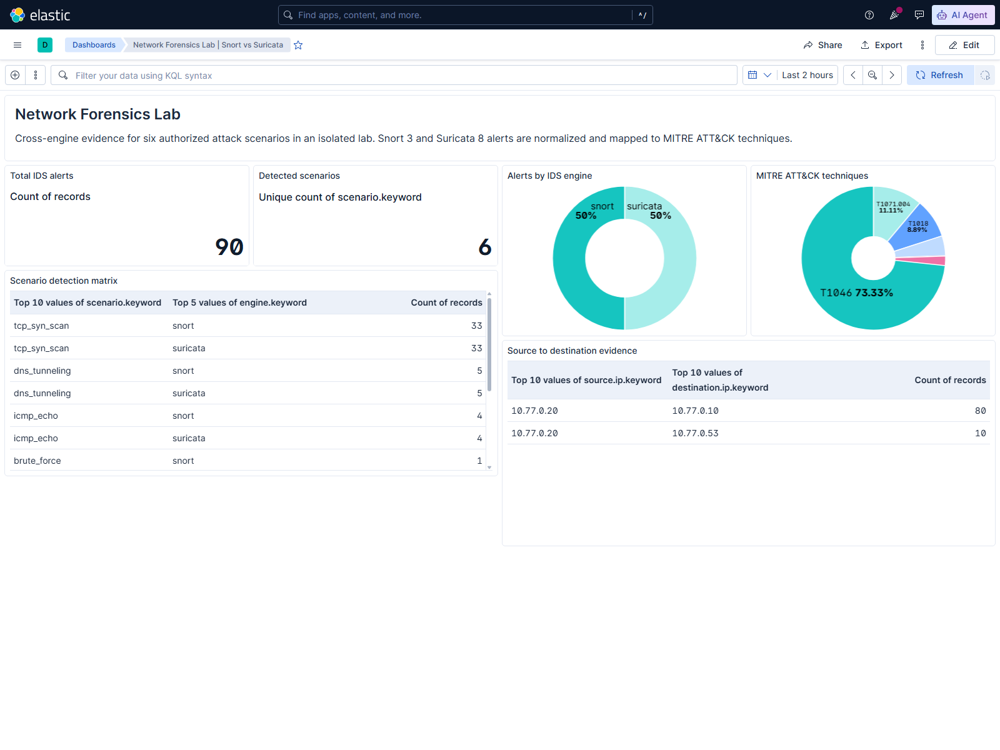

<!--
Velog 제목: Snort 하나로 끝내지 않았다: Suricata·Sigma·Kibana Lens까지 연결한 네트워크 포렌식 랩
Velog 태그: 네트워크보안, 디지털포렌식, Snort, Suricata, Wireshark, ELK, Docker, MITREATTACK
-->

# Snort 하나로 끝내지 않았다: Suricata·Sigma·Kibana Lens까지 연결한 네트워크 포렌식 랩

보안 도구를 설치해 보는 것과, 한 패킷이 **수집 → 무결성 검증 → 탐지 → 정규화 → 표준 매핑 → 시각화**되는 흐름을 끝까지 만드는 것은 다른 문제다.

첫 버전에서는 Docker 격리망에 Kali, Nginx, Snort, Elastic Stack을 올리고 ICMP·HTTP probe·SYN scan을 탐지했다. 동작은 했지만 아쉬움이 있었다.

- 탐지 엔진이 Snort 하나라 결과를 교차 검증할 수 없었다.
- 시나리오가 3개라 credential access나 DNS C2 형태를 설명하기 어려웠다.
- Kibana는 Discover 화면만 사용했고 dashboard가 코드로 재현되지 않았다.
- ATT&CK과 Sigma 연결이 없었다.
- CI가 실제 PCAP을 IDS로 다시 분석하지 않았다.

그래서 두 번째 단계에서는 “도구 추가”보다 **증거의 연결성과 반복 검증**에 집중했다.

## 최종 결과

현재 저장소 fixture에서 얻은 결과는 다음과 같다.

| 항목 | 결과 |
|---|---:|
| 공격 시나리오 | 6개 |
| PCAP | 159 packets / 16,025 bytes |
| Snort 경보 | 45건 |
| Suricata 경보 | 45건 |
| 양쪽 IDS에서 탐지된 시나리오 | 6 / 6 |
| Sigma 규칙 | 6개 valid |
| Python 테스트 | 23개 통과 |
| 전체 coverage | 91% |

이 수치는 로컬 회귀 fixture 결과다. “운영 환경 공격 탐지 정확도 100%”로 일반화하면 안 된다.



## 1. 안전한 테스트 망부터 설계했다

랩의 공격망은 `10.77.0.0/24` 고정 사설 대역이며 Docker Compose에서 외부 라우팅을 막았다.

```yaml
networks:
  lab_net:
    internal: true
    ipam:
      config:
        - subnet: 10.77.0.0/24
```

역할은 다음과 같다.

- Kali: `10.77.0.20`, 트래픽 생성과 tcpdump
- Nginx victim: `10.77.0.10`, HTTP target
- CoreDNS: `10.77.0.53`, DNS query target
- Snort·Suricata: 네트워크 없이 PCAP만 오프라인 분석

IDS 서비스에는 다음 경계를 적용했다.

```yaml
snort:
  network_mode: none

suricata:
  network_mode: none
```

캡처 단계와 분석 단계를 분리하면 같은 PCAP을 두 엔진이 읽는다. 입력 차이가 없어 규칙 결과만 비교할 수 있고, 분석 컨테이너가 외부 통신을 할 이유도 없다.

## 2. 시나리오를 6개로 확장했다

모든 트래픽은 격리 컨테이너의 고정 IP만 대상으로 한다.

```text
icmp_echo          ICMP echo request
http_admin_probe   GET /admin?cmd=id
tcp_syn_scan       제한된 TCP SYN scan
brute_force        반복 HTTP Basic 인증
dns_tunneling      긴 subdomain DNS query
web_exploit        SQL injection 형태 query
```

트래픽 생성기는 한 파일에 모았다.

```powershell
docker compose exec -T kali sh /lab/generate-traffic.sh
```

시나리오 이름, Snort SID, Suricata SID, ATT&CK 정보는 `detection/rule-catalog.json`을 단일 기준으로 사용한다.

```json
{
  "scenario": "dns_tunneling",
  "snort_sid": 1000005,
  "suricata_sid": 1000005,
  "attack": {
    "tactic": "Command and Control",
    "technique_id": "T1071.004",
    "technique_name": "DNS"
  }
}
```

규칙 파일과 문서에 ATT&CK 값을 따로 복사하면 언젠가 어긋난다. catalog를 기준으로 정규화기가 두 엔진 이벤트에 같은 위협 정보를 붙이도록 했다.

## 3. Snort와 Suricata를 같은 스키마로 정규화했다

두 엔진의 원본 이벤트 구조는 다르다.

Snort는 대략 다음 형태다.

```json
{
  "timestamp": "08/08-14:20:16.567509",
  "src_addr": "10.77.0.20",
  "dst_addr": "10.77.0.53",
  "sid": 1000005
}
```

Suricata EVE는 중첩 구조를 사용한다.

```json
{
  "timestamp": "2026-08-08T14:20:16.567509+0900",
  "src_ip": "10.77.0.20",
  "dest_ip": "10.77.0.53",
  "alert": {
    "signature_id": 1000005
  }
}
```

Python 파이프라인은 둘을 다음 공통 구조로 바꾼다.

```json
{
  "@timestamp": "2026-08-08T05:20:16.567509Z",
  "engine": "snort",
  "scenario": "dns_tunneling",
  "source": { "ip": "10.77.0.20" },
  "destination": { "ip": "10.77.0.53", "port": 53 },
  "threat": {
    "technique": { "id": "T1071.004", "name": "DNS" }
  }
}
```

여기서 중요한 보안 판단이 하나 있다. HTTP Basic 인증처럼 자격 증명 원문이 포함될 수 있는 payload는 정규화 evidence로 복사하지 않았다. 분석에 필요한 메타데이터와 rule identity만 유지했다.

## 4. 엔진 간 탐지 결과를 자동 비교했다

비교기는 catalog의 6개 시나리오를 기준으로 엔진별 경보 수를 계산한다.

```powershell
.\scripts\run-comparison.ps1
```

결과는 `evidence/ids-comparison.json`에 저장된다.

```json
{
  "scenario": "brute_force",
  "snort_alerts": 1,
  "suricata_alerts": 1,
  "delta": 0,
  "detected_by_both": true
}
```

하나라도 양쪽에서 탐지되지 않으면 스크립트가 실패한다. 따라서 화면에서 “있어 보이는” 결과가 아니라 CI가 판정할 수 있는 acceptance criterion이 된다.

## 5. PCAP 자체도 독립 검증했다

해시 문자열만 비교하면 파일 형식이 정상인지 알 수 없다. 간단한 PCAP parser를 구현해 다음을 함께 검사했다.

- SHA-256 expected/actual
- PCAP magic number와 byte order
- format version
- snap length와 link type
- packet header 순회
- captured/original byte 합계
- truncated packet 여부

실행 예시는 다음과 같다.

```powershell
python -m forensics.cli verify-fixture `
  --pcap evidence/lab-traffic.pcap `
  --checksum evidence/lab-traffic.pcap.sha256
```

현재 SHA-256은 다음과 같다.

```text
93160865ac7136c6f609e8c72a4940326e4c0ec22c16b9ab18f3463d09ae82f0
```

## 6. ATT&CK과 Sigma를 연결했다

각 시나리오에는 Sigma 규칙이 하나씩 있다.

```yaml
title: LAB DNS Tunneling Pattern
status: test
logsource:
  category: network_detection
detection:
  selection:
    scenario: dns_tunneling
  condition: selection
tags:
  - attack.command-and-control
  - attack.t1071.004
level: high
```

validator는 다음을 확인한다.

- `title`, `id`, `status`, `logsource`, `detection`, `level`
- ATT&CK technique tag 존재
- 각 시나리오에 대응하는 규칙 수

```powershell
python -m forensics.cli validate-sigma --directory detection/sigma
```

Sigma 전체 엔진을 대체하려는 것이 아니라, 탐지 의도를 portable rule 형태로 문서화하고 CI에서 schema regression을 잡기 위한 범위다.

## 7. Kibana Lens dashboard를 코드로 만들었다

처음에는 Kibana Discover 화면만 사용했다. 하지만 수동으로 만든 화면은 다른 PC에서 재현되지 않는다.

Kibana 공식 API로 다음을 자동화했다.

1. `/api/status`가 `available`이 될 때까지 대기
2. `ids-alerts-*` 데이터 뷰 생성
3. 고정 ID `network-forensics-overview` dashboard upsert
4. Lens metric, pie, data table 패널 선언
5. Headless Chrome으로 실제 렌더링 캡처

대시보드에는 다음 정보가 보인다.

- 전체 IDS 경보 수
- 고유 시나리오 수
- Snort vs Suricata 비율
- ATT&CK technique 분포
- scenario × engine 탐지 matrix
- source → destination evidence

고정 ID에 `PUT`하므로 스크립트를 여러 번 실행해도 dashboard가 중복 생성되지 않는다.

## 8. 실제 통합 장애를 테스트로 바꿨다

### Elasticsearch가 준비되기 전에 API 호출

컨테이너가 `running`이어도 JVM과 REST API는 아직 준비 중일 수 있었다. 인덱스 삭제 요청이 먼저 도착해 연결이 끊겼다.

해결은 `/_cluster/health?wait_for_status=yellow`를 제한 시간 동안 확인하는 것이었다.

### Elasticsearch 9의 wildcard 삭제 거부

`DELETE /ids-alerts-*`는 안전 정책으로 실패했다. 이를 우회하지 않고 더 안전하게 바꿨다.

1. `_cat/indices/ids-alerts-*`로 실제 이름 조회
2. 접두사 재검증
3. 정확한 이름만 개별 삭제

### 패킷 수를 하드코딩한 테스트

초기 테스트는 예전 PCAP의 `84 packets`를 기대했다. 새 시나리오를 추가하자 정상 변경인데도 실패했다.

fixture가 유효하다는 조건과 특정 캡처 결과를 구분했다.

- 테스트: packet count가 0보다 크고 parser byte 수가 hash 검증 byte 수와 일치
- evidence: 해당 실행의 정확한 159 packets 기록

## 9. GitHub Actions에서 실제 IDS를 다시 돌린다

CI는 Python unit test만 실행하지 않는다.

```text
checkout action SHA pin
  → Python test + branch coverage
  → PCAP hash/structure
  → Sigma validation
  → Snort offline regression
  → Suricata offline regression
  → cross-engine acceptance
  → syntax checks
```

커밋된 규칙이 문법상 유효해도 PCAP에서 탐지하지 못하면 실패한다. 이것이 이 프로젝트에서 가장 중요한 detection-as-code 품질 게이트다.

## 10. 한 번에 실행하기

```powershell
git clone https://github.com/teriyakki-jin/network-forensics-lab.git
Set-Location .\network-forensics-lab
powershell -NoProfile -ExecutionPolicy Bypass -File .\scripts\run-lab.ps1
```

Elastic Stack을 제외하고 PCAP과 IDS만 확인하려면:

```powershell
.\scripts\run-lab.ps1 -SkipElastic
```

종료:

```powershell
docker compose down -v --remove-orphans
```

## 마무리

이번 업그레이드에서 가장 중요했던 변화는 Snort 옆에 Suricata 아이콘을 하나 더 붙인 것이 아니다.

```text
Threat fixture
→ PCAP integrity
→ two IDS engines
→ normalized evidence
→ ATT&CK + Sigma
→ Kibana Lens
→ CI regression
```

각 단계가 앞 단계의 증거를 받아 다음 단계에서 검증할 수 있게 연결했다. 덕분에 이 프로젝트는 단순 도구 설치 기록보다 격리 설계, 포렌식 무결성, detection engineering, 데이터 파이프라인, 자동화 테스트를 함께 보여 주는 포트폴리오가 되었다.

GitHub: https://github.com/teriyakki-jin/network-forensics-lab
